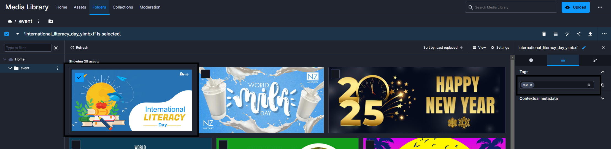

<div align="center">
<h1> SE - Events Platform</h1> 
A project that allows community members to view, sign up for, and add events to their own personal calendar. Staff members have additional functionality to create and manage events.
<br><br>

[](https://github.com/Tianyu-00)

[Prerequisites](#prerequisites) | [Getting Started](#getting-started) | [Environment Variables](./sources/notes/Template_Env.md) | [Testing](./sources/notes/Testing.md) | [Notes](#notes)

[](https://github.com/TianYu-00/SE-Events-Platform/actions/workflows/ci.yml)


|                  **Frontend**                  |                     **Backend**                      |      **Database**      |               **Youtube Demo**                |
|:----------------------------------------------:|:----------------------------------------------------:|:----------------------:|:---------------------------------------------:|
|              _https://vercel.com_              |                 _https://render.com_                 | _https://supabase.com_ |           _https://www.youtube.com_           |
| _https://se-events-platform-tianyu.vercel.app_ | _https://se-events-platform-tianyu.onrender.com/api_ |       _Private_        | _https://www.youtube.com/watch?v=wJTZPR6swyg_ |

</div>

# Prerequisites
#### Before getting started, ensure you have the following installed:
- **Node.js** v21.7.2 - [Download](https://nodejs.org/en/download)
- **PostgreSQL** v14.15 - [Download](https://www.postgresql.org/download/)
- **Stripe CLI** v1.23.3 - [Docs](https://docs.stripe.com/stripe-cli)
- **Ngrok** v3.19.1 - [Download](https://ngrok.com/)

#### You will also need the keys from the following service providers. Refer to the [Environment Variables](./sources/notes/Template_Env.md) section for the exact keys required. 
- [Clerk](https://clerk.com/)
- [Stripe](https://stripe.com/)
- [Cloudinary](https://cloudinary.com/)


To save you some time, I have written some [instructions](./sources/notes/Environment_Variables_Guide.md) to hopefully help you out with installing and getting these environment variable keys.

# Getting Started
### Clone the github repository
```
git clone https://github.com/TianYu-00/SE-Events-Platform.git
```
### Create terminals
Create 4 terminals to run our `backend`, `frontend`, `clerk webhook listener` and `ngrok webhook listener`.
## Backend
### To set up and run the backend
1) Navigate to the backend directory:
```
cd backend
```
2) Install dependencies:
```
npm install
```
3) Create the [environment variables](./sources/notes/Template_Env.md)
4) Setup the database:
```
npm run setup-db
```
5) Seed the database:
```
npm run seed
```
6) Start the server:
```
npm start
```

## Frontend
### To set up and run the frontend
1) Navigate to the frontend directory:
```
cd frontend
```
2) Install dependencies:
```
npm install
```
3) Create the [environment variables](./sources/notes/Template_Env.md)
4) Start the development server:
```
npm run dev
```

## Clerk Webhook Listener
1) Make sure you have installed Clerk's CLI and have authenticated.
2) Listen to the backend stripe webhook route.
```
stripe listen --forward-to http://localhost:9090/api/stripe/webhook
```

## Ngrok Webhook Listener
1) Make sure you have installed Ngrok and have authenticated
2) Listen to the backend port
```
ngrok http 9090
```

# Notes

> [!NOTE]
Please bear in mind that I have configured the hosted project to reset the database on every restart. This means that if the Express server shuts down due to inactivity and then restarts, the database will be seeded again.

> [!NOTE]  
You won't be able to delete my test data images from Cloudinary (account: dv3fz3nmg). If you try, a console log error will occur, but it won't affect functionality.
To avoid this, replace the event thumbnails in `./backend/db/test_data/events.js` with your own images from your Cloudinary and seed the database again.

> [!NOTE]
Add a `test` tag to your Cloudinary image to prevent it from being deleted when events are removed.


