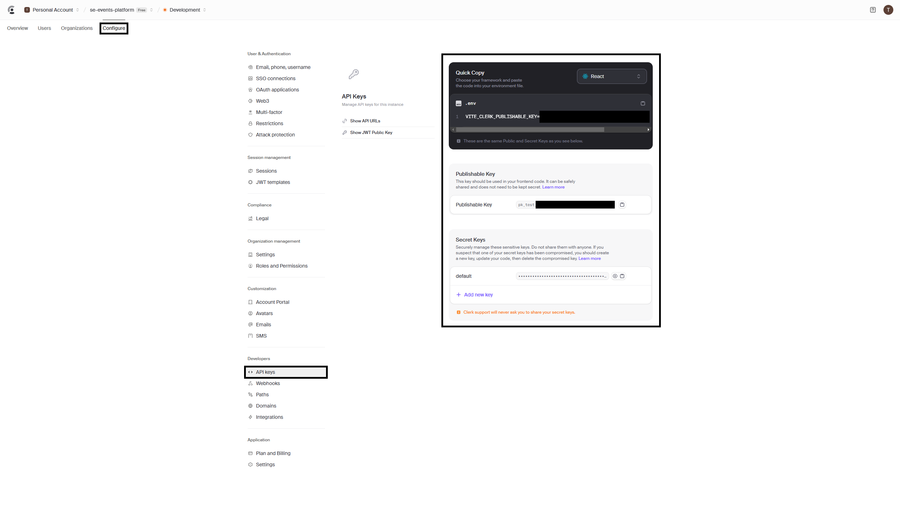
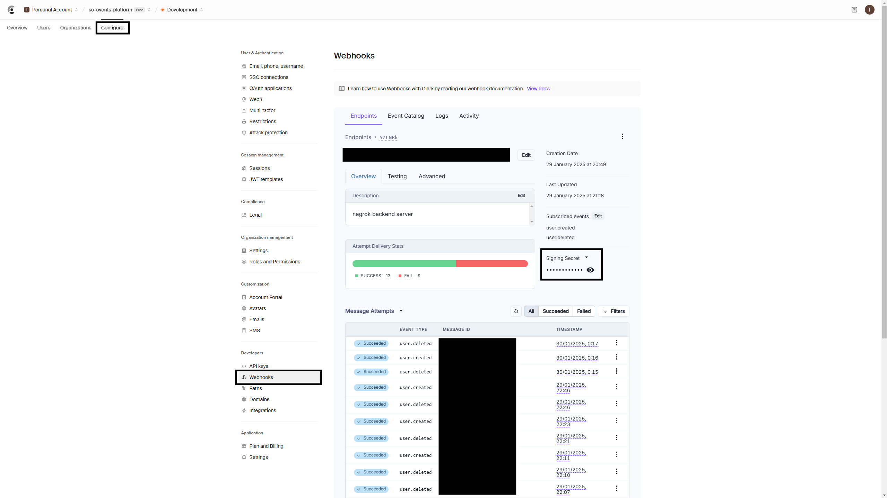
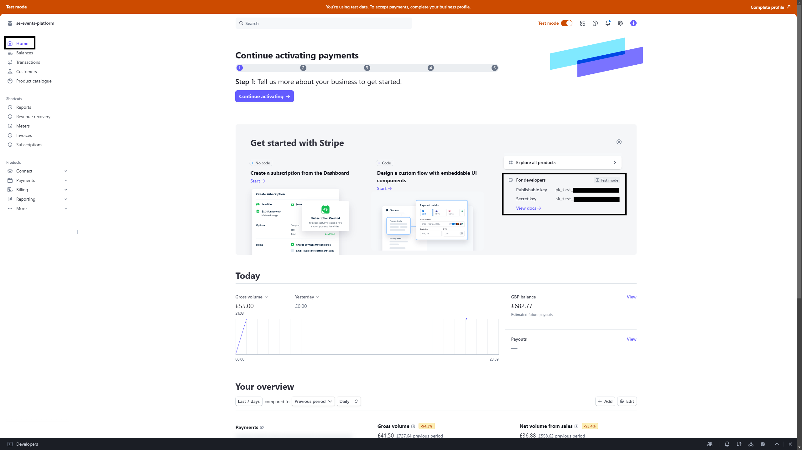
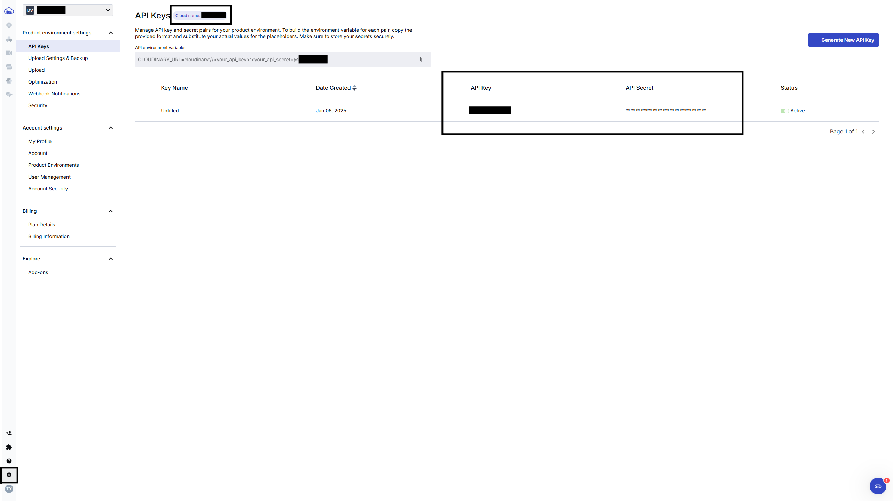
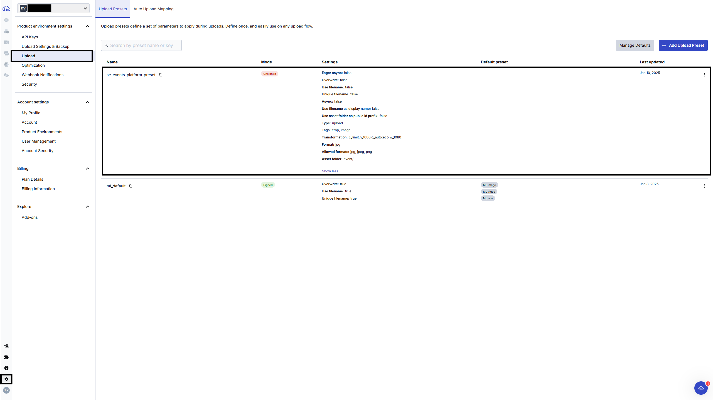

<div align="center">
<h1> SE - Events Platform</h1> 
Project that allows community members to view, sign up for and add events to their own personal calender. Staff members have additional functionality to create and manage events.
<br><br>

[](https://github.com/Tianyu-00)

[Prerequisites](#prerequisites) | [Getting Started](#getting-started) | [Environment Variables](#environment-variables) | [Testing](#testing)

[](https://github.com/TianYu-00/SE-Events-Platform/actions/workflows/ci.yml)


|                  **Frontend**                  |                     **Backend**                      |      **Database**      |
|:----------------------------------------------:|:----------------------------------------------------:|:----------------------:|
|              _https://vercel.com_              |                 _https://render.com_                 | _https://supabase.com_ |
| _https://se-events-platform-tianyu.vercel.app_ | _https://se-events-platform-tianyu.onrender.com/api_ |       _Private_        |

</div>

# Prerequisites
#### Before getting started, ensure you have the following installed:
- **Node.js** v21.7.2 - [Download](https://nodejs.org/en/download)
- **PostgreSQL** v14.15 - [Download](https://www.postgresql.org/download/)
- **Stripe CLI** v1.23.3 - [Docs](https://docs.stripe.com/stripe-cli)
- **Ngrok** v3.19.1 - [Download](https://ngrok.com/)

#### You will also need the following keys. Refer to the [Environment Variables](#environment-variables) section for the exact keys required. 
- [Clerk](https://clerk.com/)
- [Stripe](https://stripe.com/)
- [Cloudinary](https://cloudinary.com/)


To save you some time, I have written some [instructions](#environment-variables-guide) to hopefully help you out with getting some of these keys and variables.

# Getting Started
### Clone the repo
```
git clone https://github.com/TianYu-00/SE-Events-Platform.git
```
## Backend
### To set up and run the backend
1) Navigate to the backend repository:
```
cd backend
```
2) Install dependencies:
```
npm install
```
3) Create the [environment variables](#environment-variables)
4) Start the server:
```
npm start
```

## Frontend
### To set up and run the frontend
1) Navigate to the frontend repository:
```
cd frontend
```
2) Install dependencies:
```
npm install
```
3) Create the [environment variables](#environment-variables)
4) Start the development server:
```
npm run dev
```

# Environment Variables
### Backend `.env.development`
``` 
# Express
PORT=9090

# Database
PGDATABASE=se_events_platform

# Clerk
CLERK_PUBLISHABLE_KEY=
CLERK_SECRET_KEY=
CLERK_SIGNING_SECRET=

# Cloudinary
CLOUDINARY_CLOUD_NAME=
CLOUDINARY_API_KEY=
CLOUDINARY_API_SECRET=

#Stripe
STRIPE_SECRET_KEY=
STRIPE_WEBHOOK_SECRET=
```

### Backend (Optional) `.env.test`
``` 
# Express
PORT=9090

# Database
PGDATABASE=se_events_platform_test

# Clerk
CLERK_PUBLISHABLE_KEY=
CLERK_SECRET_KEY=
CLERK_TESTING_ADMIN_TOKEN=
CLERK_TESTING_USER_TOKEN=

#Stripe
STRIPE_SECRET_KEY=
```

### Backend (Optional) `.env.production` 
``` 
# Express
PORT=
FRONTEND_URL=

# Database
DATABASE_URL=

# Clerk
CLERK_PUBLISHABLE_KEY=
CLERK_SECRET_KEY=
CLERK_SIGNING_SECRET=

# Cloudinary
CLOUDINARY_CLOUD_NAME=
CLOUDINARY_API_KEY=
CLOUDINARY_API_SECRET=

#Stripe
STRIPE_SECRET_KEY=
STRIPE_WEBHOOK_SECRET=

```

### Frontend `.env.local`
```
#Clerk
VITE_CLERK_PUBLISHABLE_KEY=

#Cloudinary
VITE_CLOUDINARY_CLOUD_NAME=
VITE_CLOUDINARY_UPLOAD_PRESET_NAME=
VITE_CLOUDINARY_API_KEY=

#Stripe
VITE_STRIPE_PUBLISHABLE_KEY=
```

### Frontend (Optional) `.env.production`
```
#
VITE_BACKEND_URL=

#Clerk
VITE_CLERK_PUBLISHABLE_KEY=

#Cloudinary
VITE_CLOUDINARY_CLOUD_NAME=
VITE_CLOUDINARY_UPLOAD_PRESET_NAME=
VITE_CLOUDINARY_API_KEY=

#Stripe
VITE_STRIPE_PUBLISHABLE_KEY=
```

# Environment variables guide
Please refer to docs instead if any of these instructions are outdated in the future.
## Clerk
#### Publisher Key and API Key


#### Signing secret
Please refer to Clerk's [set-up-ngrok](https://clerk.com/docs/webhooks/sync-data#set-up-ngrok) to setup your ngrok tunnel forwarding to your local backend server.


#### User & Admin test tokens
Please refer to this clerk's [documentation](https://clerk.com/docs/testing/postman-or-insomnia#generate-long-lived-jwt-template) to create your user and admin long lived JWT tokens.


## Stripe
#### Publisher Key and Secret Key


#### Signing Secret
Please refer to this documentation to setup Stripe CLI on your machine to get your webhook secret.
https://docs.stripe.com/stripe-cli

For me on ubuntu this is what i have done:
1) Download stripe's linux build v1.23.3. https://github.com/stripe/stripe-cli/releases
```
wget https://github.com/stripe/stripe-cli/releases/download/v1.23.3/stripe_1.23.3_linux_x86_64.tar.gz
```

2) Extract it
```
tar -xvzf stripe_1.23.3_linux_x86_64.tar.gz
```

3) Move the files over to system directory
```
sudo mv stripe /usr/local/bin/
```

4) Check the version to make sure its installed properly
```
stripe --version
```

5) Login
```
stripe login
``` 

6) Listen to the backend webhook route
```
stripe listen --forward-to localhost:9090/api/stripe/webhook
```


## Cloudinary
#### Cloud Name, API Key and API secret


#### Upload Preset Name



## Database
#### PGDatabase (database name)
Please refer to the file located at: `backend`/`db`/`create_database.sql`.
Here is an example of how it would look like at the time of writing this:
```
DROP DATABASE IF EXISTS se_events_platform;
CREATE DATABASE se_events_platform;

DROP DATABASE IF EXISTS se_events_platform_test;
CREATE DATABASE se_events_platform_test;
```

#### Database URL
You don't need this unless if you are deploying this project. It usually looks like this:
```
postgresql://<username>:<password>@<host>:<port>/<database>
```

# Testing
## Backend
#### Test API endpoints
1) Navigate to backend:
```
cd backend
```
2) Run the tests:
```
npm test
```

## Frontend
#### Test Clerk Accounts

| **Role** | **Email**                    | **Password** |
|----------|------------------------------|--------------|
| User     | user+clerk_test@example.com  | user123      |
| Admin    | admin+clerk_test@example.com | admin123     |


#### Test Stripe Cards

| **Card Status** | **Card Number**  |
|-----------------|------------------|
| Success         | 4000008260000000 |
| Decline         | 4000000000000002 |

Please refer to this [documentation](https://docs.stripe.com/testing?testing-method=card-numbers#visa) for more card options.
