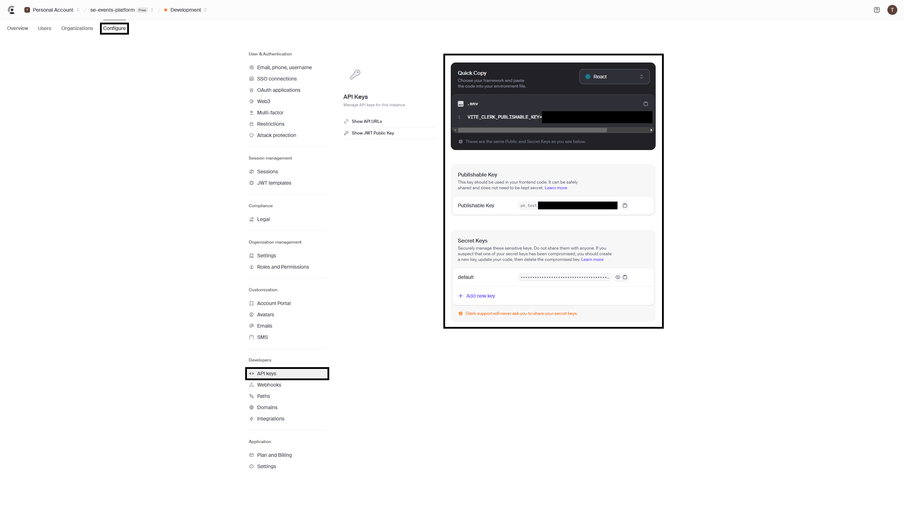
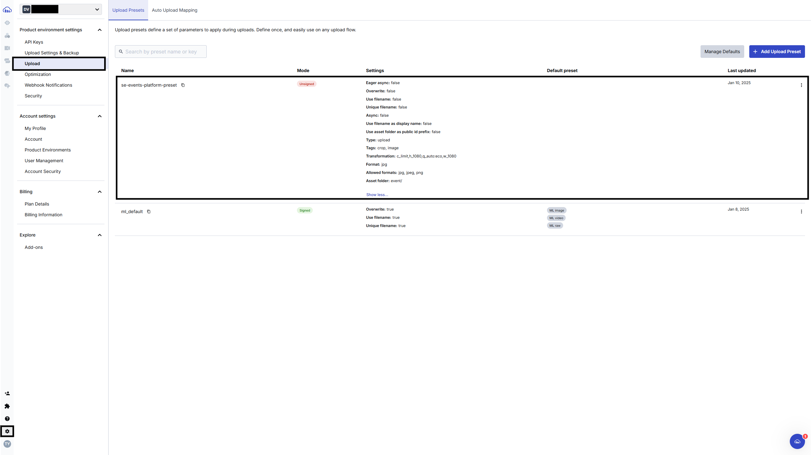

# Environment Variables Guide
Please refer to the documentation instead if any of these instructions are outdated in the future.
## Clerk
#### Publisher Key and API Key

<!--  -->

#### Signing Secret
Please refer to Clerk's [set-up-ngrok](https://clerk.com/docs/webhooks/sync-data#set-up-ngrok) to set up your ngrok tunnel forwarding to your local backend server.


#### User & Admin Test Tokens
Please refer to this Clerk's [documentation](https://clerk.com/docs/testing/postman-or-insomnia#generate-long-lived-jwt-template) to create your user and admin long-lived JWT tokens.


## Stripe
#### Publisher Key and Secret Key


#### Signing Secret
Please refer to this documentation to set up Stripe CLI on your machine to get your webhook secret.
https://docs.stripe.com/stripe-cli

For me on Ubuntu, this is what I have done:
1) Download Stripe's Linux build v1.23.3. https://github.com/stripe/stripe-cli/releases
```
wget https://github.com/stripe/stripe-cli/releases/download/v1.23.3/stripe_1.23.3_linux_x86_64.tar.gz
```

2) Extract it
```
tar -xvzf stripe_1.23.3_linux_x86_64.tar.gz
```

3) Move the files over to the system directory
```
sudo mv stripe /usr/local/bin/
```

4) Check the version to make sure it's installed properly
```
stripe --version
```

5) Login
```
stripe login
``` 

6) Listen to the backend webhook route
```
stripe listen --forward-to localhost:9090/api/stripe/webhook
```


## Cloudinary
#### Cloud Name, API Key, and API Secret


#### Upload Preset Name



## Database
#### PGDatabase (database name)
Please refer to the file located at: `backend`/`db`/`create_database.sql`.
Here is an example of how it would look at the time of writing this:
```
DROP DATABASE IF EXISTS se_events_platform;
CREATE DATABASE se_events_platform;

DROP DATABASE IF EXISTS se_events_platform_test;
CREATE DATABASE se_events_platform_test;
```

#### Database URL
You won't need this unless if you are deploying this project. It usually looks like this:
```
postgresql://<username>:<password>@<host>:<port>/<database>
```