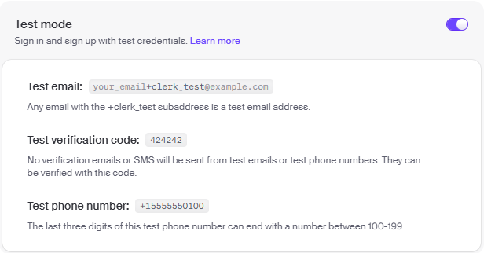

## Backend
#### Test API Endpoints
1) Navigate to the backend:
```
cd backend
```
2) Run the tests:
```
npm test
```

## Frontend
#### Test Clerk Accounts
Note: These test accounts are not deletable, if you would like to test user.deleted webhook please create your own account.

| **Role** | **Email**                    | **Password** |
|----------|------------------------------|--------------|
| User     | user+clerk_test@example.com  | user123      |
| Admin    | admin+clerk_test@example.com | admin123     |

If you'd like to create a fake account for testing, please follow the instructions below to set up test accounts.




#### Test Stripe Cards

| **Card Status** | **Card Number**  | **Expiry Date**   | **Security Code**   | **Postal Code**    |
|-----------------|------------------|-------------------|---------------------|--------------------|
| Success         | 4000008260000000 | valid future date | any three-digit CVC | Any valid Postcode |
| Decline         | 4000000000000002 | valid future date | any three-digit CVC | Any valid Postcode |

Please refer to this [documentation](https://docs.stripe.com/testing?testing-method=card-numbers#visa) for more card options.